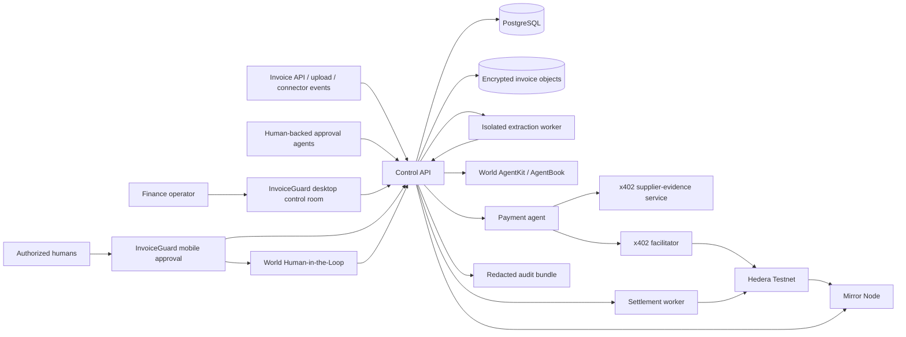
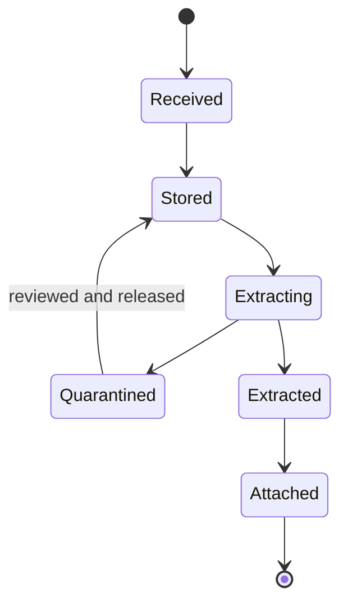
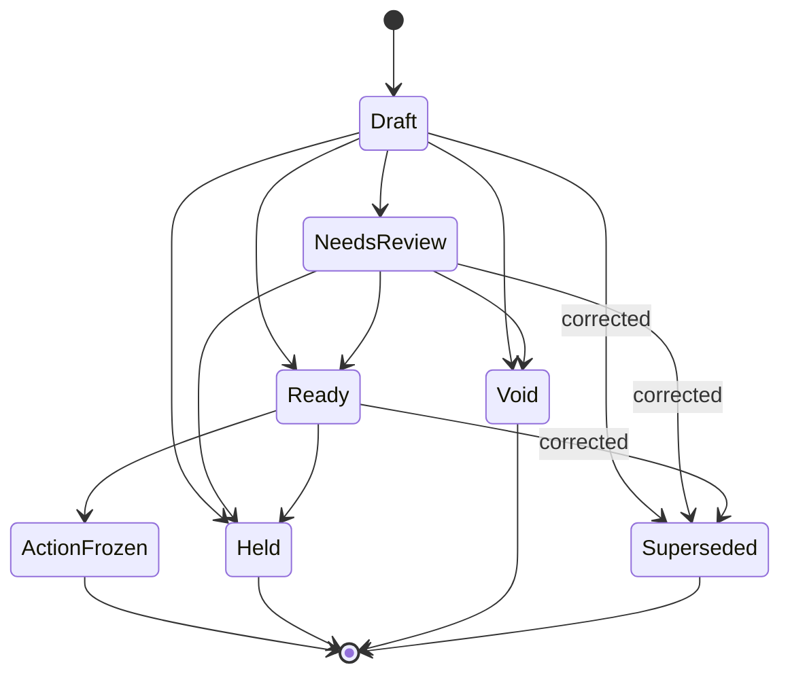
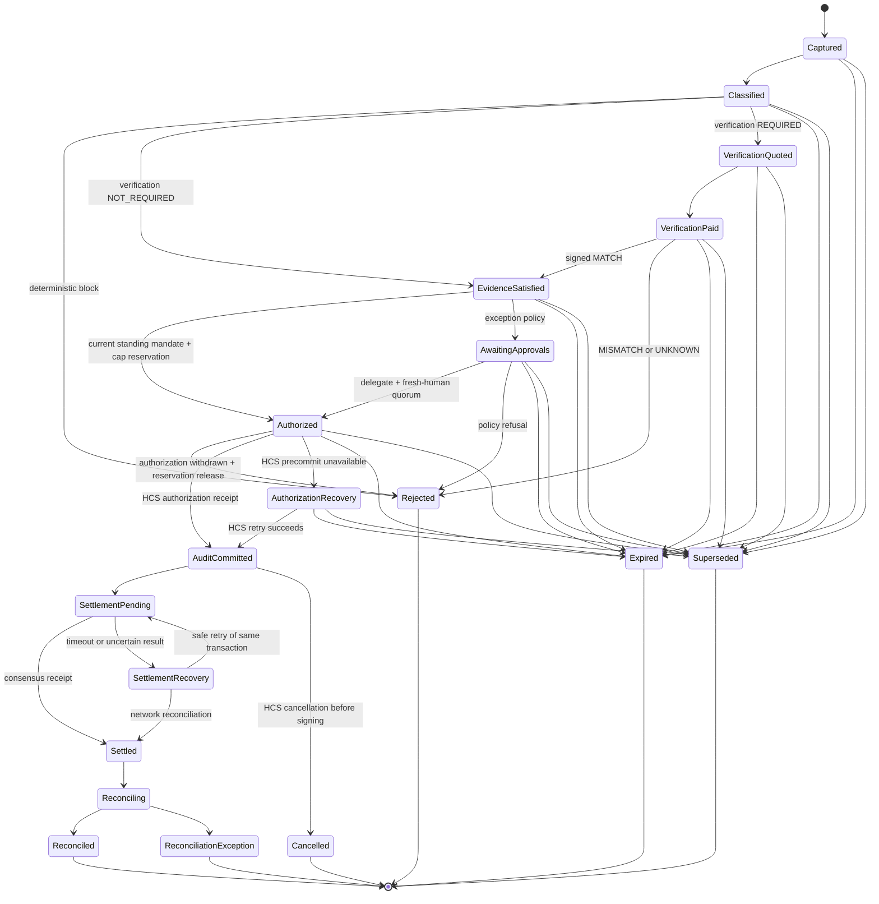

# System architecture

Status: proposed foundation. Sponsor-specific details are frozen only after
their first-party integration spikes pass.

## Architecture principles

1. Deterministic policy, not an LLM, authorizes value movement.
2. Agent backing, company role, standing mandate, action-time human decision,
   agent execution, evidence, and settlement are separate facts.
3. Every external effect is idempotent, replay-resistant, observable, and
   recoverable after process failure.
4. Keys are split by purpose and held only by the component that needs them.
5. Financial operations use Hedera Testnet only. World Chain is used only for
   AgentBook identity registration and lookup.
6. Live sponsor adapters fail closed. A mock can never silently replace a failed
   live dependency.
7. Sensitive evidence and stable identifiers are minimized in logs, databases,
   receipts, and onchain messages.
8. One action digest follows the request through every approval, service
   response, payment, audit event, and settlement.

## System context



## Deployable boundaries

| Deployable                   | Responsibility                                                                               | Secrets                                          |
| ---------------------------- | -------------------------------------------------------------------------------------------- | ------------------------------------------------ |
| `apps/web`                   | Responsive desktop control room and mobile approval experience                               | No treasury, issuer, provider, RP, or agent keys |
| `apps/control-api`           | Invoice acceptance, authentication, deterministic policy, action state, API, audit           | Database, object-store, connector, and HMAC keys |
| `services/extraction-worker` | Sandboxed parsing and candidate-field extraction from one staged document                    | No long-lived secret and no network egress       |
| `services/verifier`          | x402 resource, evidence check, and signed digest-bound response                              | Service-signing key                              |
| `services/payment-agent`     | Autonomously purchases the configured verifier resource                                      | Low-balance x402 buyer key                       |
| `services/x402-facilitator`  | Verifies, co-signs, submits, and settles Hedera x402 transactions                            | Capped facilitator fee-payer key                 |
| `services/settlement-worker` | Plans, guards, signs, submits, and recovers the exact approved transfer; writes HCS evidence | Separate settlement and audit-writer keys        |

The control API remains a modular monolith. Untrusted document parsing is
separate because attachment bytes are an execution boundary: each extraction job
receives one staged input and a one-use result capability, runs with strict CPU,
memory, file, and time limits, and has no network egress or long-lived database,
object-store, connector, HMAC, or financial credential. The verifier is separate
because it is an independently purchased service. The x402 buyer, facilitator,
and settlement worker are separate because they hold different keys and the
current x402 and Agent Kit packages require incompatible Hedera SDK graphs. They
exchange only validated JSON, decimal strings, identifiers, and base64
transaction bytes—never SDK class instances.

0G remains documented as a rejected extension in ADR 0005. It has no runtime
package, credential, or deployment.

## Package boundaries

```text
apps/
  web/
  control-api/
services/
  extraction-worker/
  verifier/
  payment-agent/
  x402-facilitator/
  settlement-worker/
packages/
  domain/              pure entities, values, policy and state transitions
  protocol/            schemas, canonical serialization and signed envelopes
  persistence/         database schema, repositories and transactional outbox
  runtime-config/      fail-closed process identity and environment validation
  world-adapter/       AgentKit and AgentBook integration
  hedera-x402-adapter/ x402 buyer/facilitator protocol and receipts
  hedera-settlement-adapter/ Agent Kit, signing guard, HCS and Mirror
```

Dependencies point inward. Sponsor SDKs may be imported only by their dedicated
adapter packages. Deployables consume validated adapter interfaces. The domain
package depends on the sponsor-neutral protocol verification surface so a
deserialized action or mandate is revalidated before a transition; it has no
network, database, framework, or sponsor dependency.

## Interface boundary

`apps/web` is the only human-facing application. Its desktop routes expose the
invoice queue, source and supplier comparison, deterministic policy trace,
authority state, execution timeline, refusal attempts, reconciliation, and audit
evidence. Its mobile route exposes only the exact exception fields required for
one short-lived approval session.

Both layouts fetch sanitized projections from the control API with `no-store`
semantics. A live dependency failure is rendered as unavailable and never causes
a fixture fallback. Installability may use a web manifest, but service workers
do not cache sensitive projections or queue mutations.

## Invoice ingestion and provenance

The control API accepts source observations through organization-scoped,
idempotent boundaries. Upload is one API client; email, accounting, procurement,
and e-invoice integrations are connector adapters around the same acceptance
port. V1 creates no separate ingestion microservice.

```text
POST /v1/orgs/{org}/invoices
POST /v1/connections/{kind}/{connection}/events
POST /v1/orgs/{org}/connections/{connection}/sync
```

`POST /invoices` is the sole acceptance contract for direct API calls and
authenticated uploads. It returns `202 Accepted` with an immutable
`observationId`; it does not claim that normalization has already produced an
invoice. Connectors translate verified external events into the same internal
command. Client submissions require an idempotency key and request-body hash.
Webhooks require a pinned signature and unique external event ID; the connection
resolves the organization server-side. Arbitrary remote URL ingestion is
forbidden. Content type and size are bounded before storage and parsing.

Raw documents are encrypted in object storage. PostgreSQL stores hashes,
metadata, normalized facts, immutable snapshots, lifecycle state, and object
references. The control plane leases a durable extraction job to the isolated
worker using a one-document input capability and a one-use result capability.
The worker receives no long-lived secret and has no network egress. Until that
sandbox is exercised, the live hackathon intake accepts only the controlled
synthetic fixture set.

InvoiceGuard keeps three records:

### Source observation

```text
schemaVersion
observationId
organizationId
sourceKind            UPLOAD | EMAIL | API | ACCOUNTING
connectionId
externalEventId
sourceTrustClass
receivedAt
mediaType
byteLength
contentSha256
actorReference
```

### Canonical invoice

```text
schemaVersion
invoiceId
invoiceRevision
invoiceRevisionId
supersedesInvoiceRevisionId
obligationId
organizationId
supplierId
supplierSnapshotDigest
invoiceNumber
issueDate
dueDate
netAmountAtoms
taxAmountAtoms
totalAmountAtoms
invoiceAssetId
proposedBeneficiary
purchaseOrderReferences
lineItemsRoot
sourceEvidenceRoot
createdAt
```

Extraction output is candidate data with extractor identity, version,
field-level source spans, confidence, parse warnings, observation references,
and its own immutable hash. It becomes canonical only through deterministic
validation and any required operator correction.

The supplier master is independently versioned. An invoice loads an immutable
supplier snapshot containing approved beneficiaries, default asset, payment
terms, status, source connection, and snapshot digest. Invoice ingestion cannot
change that record.

Duplicate controls distinguish:

- exact source-event replay;
- repeated document bytes;
- suspected business duplicate;
- another observation of the same invoice; and
- a previously paid payment action.

A second source may attach to the existing invoice. It cannot create another
payable silently.

## Invoice routing

A frozen policy evaluation binds the action core digest, versioned policy
configuration, versioned normalized inputs, evaluator identity, policy version,
route, reason codes, required roles and quorums, and verification mode. The
configuration and input digests form a canonical input manifest. The pure
evaluator, never its caller, derives the route and reason codes. The route is
exactly `STRAIGHT_THROUGH`, `HUMAN_APPROVAL`, or `BLOCK`. `verificationMode` is
exactly `NOT_REQUIRED` or `REQUIRED`.

`STRAIGHT_THROUGH` requires exact containment by a current standing mandate plus
an enrolled, human-backed, company-authorized payment agent. A model score never
selects this route. `HUMAN_APPROVAL` uses the exception protocol below. `BLOCK`
cannot be overridden on the existing action.

Evidence is purchased only when the frozen policy says `REQUIRED`. The
changed-beneficiary fixture requires it and cannot settle without a valid paid
result. A routine invoice may set `NOT_REQUIRED` only when its mandate and
policy version explicitly permit that route; the authorization record binds the
absence of a verifier envelope rather than silently skipping a required check.

## Action protocol

The canonical action separates the source obligation from the demonstrated
settlement effect. It contains no floating-point amounts and no ambiguous
addresses:

```text
schemaVersion
actionId
organizationId
requestType
supplierId
supplierSnapshotDigest
beneficiary {
  approved
  proposed
}
sourceInvoice {
  invoiceRevisionId
  obligationId
  digest
  amountAtoms
  assetId
}
settlement {
  beneficiary
  amountAtoms
  assetId
  networkId
  mappingPolicyHash
}
evidenceRoot
policy {
  id
  version
}
policyDecisionDigest
expiresAt
nonce
createdAt
```

- Network and account identifiers use CAIP-2 and CAIP-10 where applicable.
- V1 uses request type `SUPPLIER_INVOICE_PAYMENT`.
- Source and settlement amounts are integer atoms with separate explicit asset
  identifiers.
- `sourceInvoice.invoiceRevisionId`, `sourceInvoice.obligationId`, and
  `sourceInvoice.digest` bind the exact canonical revision, its stable payable
  obligation, and its source-currency amount.
- `mappingPolicyHash` binds the deterministic source-to-settlement mapping. It
  is never inferred from a market price or model output.
- Policy evaluation is non-circular. InvoiceGuard first hashes the action core
  without `policyDecisionDigest`. The deterministic decision binds that core
  digest, a manifest of the canonical policy configuration and normalized
  inputs, route, verification mode, mandate ID and version, required roles and
  quorums, reason codes, and validity. Bundle verification re-runs the evaluator
  from those exact inputs. The final authorization intent embeds the decision
  digest and is hashed again as `actionDigest`.
- JSON is canonicalized using RFC 8785 before SHA-256 hashing.
- The hash input includes the domain separator `invoiceguard:payment-action:v1`.
- The full action remains immutable. A changed field creates a new action and
  invalidates prior approvals and verification responses.
- Every approval, verifier response, HCS record, outbox effect, and settlement
  binds the final `actionDigest`, so a policy route cannot be swapped without
  changing the authorized action.
- Human-readable rendering is generated from the same validated object that is
  hashed.

## Approval protocol

When policy requires human approval, one counted decision requires an agent-side
and a human-side proof.

### Approval delegate

1. The control API stores the immutable action and issues a short-lived
   CAIP-122/SIWE challenge whose exact URI contains that action digest.
2. An ECDSA/secp256k1 agent identity wallet signs the challenge.
3. InvoiceGuard verifies the signature and adds strict checks for the exact URI,
   `resources`, statement, chain, signature type, method, digest, and expiry.
4. World AgentBook resolves the wallet to an anonymous human identifier. An
   independent World RPC health check distinguishes an outage from an
   unregistered wallet.
5. The control API derives
   `agentTenantPrincipal = HMAC-SHA256(orgKey, normalizedHumanId)`.
6. A separately configured company issuer verifies a role grant bound to the
   agent wallet, tenant principal, and authenticated application subject,
   including scope, audience, amount, time bounds, and revocation.

### Action-time human decision

1. The authenticated subject opens a short-lived, single-use approval session.
   The browser loads the immutable action and posts no mutable payment fields.
2. World Human-in-the-Loop uses one action identifier derived from the action
   digest, role, and decision for every slot on that action. Its signal binds
   the application subject and approval session.
3. The control API verifies the proof, recomputes the stored action digest,
   rechecks the role, and derives an action-scoped HMAC of the World nullifier.
4. One database transaction consumes the agent challenge, approval session, and
   World proof, then inserts a decision unique on all three:

   ```text
   (organizationId, actionDigest, subjectId)
   (organizationId, actionDigest, agentTenantPrincipal)
   (organizationId, actionDigest, actionHumanPrincipal)
   ```

5. Deterministic policy counts only decisions whose company subject, agent
   class, and action-human class are all distinct and whose roles remain
   current.

World identity keys, RP credentials, browser sessions, and Hedera financial
accounts are separate principals. Any mapping between them is explicit and
auditable.

The released AgentKit validator is wrapped rather than trusted as the whole
authorization check: it validates origin-level properties but does not itself
enforce the exact path, resource, HTTP method, or InvoiceGuard action. World
Human-in-the-Loop is also an additional fact, not a replacement for agent
backing or company authority.

## Verification protocol

The verifier returns a signed envelope containing:

```text
schemaVersion
serviceId
actionDigest
evidenceRoot
result              MATCH | MISMATCH | UNKNOWN
reasonCodes
issuedAt
expiresAt
servicePaymentTransactionId
providerEvidence    optional, redacted provider verification fields
```

The worker accepts the response only after validating:

- the service signature and configured service identity;
- exact action and evidence binding;
- payment transaction binding;
- result vocabulary and reason codes;
- issuance and expiry;
- no prior response substitution; and
- `MATCH` under the configured deterministic policy.

`UNKNOWN` fails closed.

The x402 facilitator's `/verify` result is not proof of payment. The verifier
releases its signed response only after `/settle` produces a Hedera consensus
receipt with `SUCCESS`. The x402 payment and the later company settlement are
separate transactions; InvoiceGuard joins them with the action digest, service
attestation, HCS authorization precommit, and durable one-use state.

The synthetic service reads a separately administered, signed supplier-change
registry fixture. The control API and payment agent have no write path to that
registry. A record contains supplier identity hash, proposed beneficiary
fingerprint, effective interval, issuer, and source-document digest. A
production adapter would replace this fixture with an independently operated
bank-account-validation or supplier-confirmation source.

The service result means only that the configured supplier-evidence policy
matched its declared inputs. It does not prove beneficiary ownership, invoice
truth, or compliance. Provider `close match`, no-match, outage, and unsupported
states map to `MISMATCH` or `UNKNOWN`, never `MATCH`.

## Payment rail

The payment action names one explicit source obligation and one explicit
settlement effect. V1 execution is Hedera Testnet only. The preferred fixture is
one allowlisted HTS fungible test token with two decimals and an explicit
no-value synthetic-EUR label, admitted only after its transfer and signing-guard
spikes pass. Its mapping policy fixes one test-token cent for one source EUR
cent; that rule and the exact token ID enter `mappingPolicyHash`.

An invoice denominated in EUR is never mapped to an arbitrary HBAR amount. If
the HTS spike fails, no invoice payment action reaches `Settled`. HBAR may still
pay for the x402 evidence service, but it is not a fallback supplier settlement.
Test assets have no monetary value and are never presented as a completed bank
or SEPA payment.

A future production `PaymentRail` may target regulated banking, open-banking, or
stablecoin infrastructure only through a new protocol version and explicit
security review.

## Source-observation lifecycle



Source observations are immutable. A retry advances the same observation; it
does not insert another payable.

## Invoice-revision lifecycle



A correction after `ActionFrozen` first supersedes or cancels the prior payment
action under the rules below, then creates a new invoice revision and action
against the same `obligationId`. The prior frozen revision remains immutable.

## Payment-action state machine



No transition mutates the canonical action. Terminal actions cannot return to an
executable state. Accounting write-back failure becomes
`ReconciliationException`; it never changes a successful payment to failed or
creates another transfer.

The persisted aggregate is not a state label beside an authorization. It carries
the reverified authorization bundle, monotonic version and transition metadata,
verification payment and evidence records, a discriminated human or mandate
authorization basis, authorization precommit, fresh execution-authority facts,
the original frozen settlement attempt, uncertainty, receipt, one-use
consumption claim, and terminal record as required by its state. Hydration
recomputes every record digest and rejects a state whose prerequisite records or
last transition are absent.

Both authorization routes revalidate the enrolled requesting agent's current
company role and AgentBook backing before settlement is frozen. The human route
also revalidates the exact originally counted approval identities and current
statuses. The mandate route revalidates the active mandate version and original
`RESERVED` claim against the current period ledger.

`obligationId` is stable across invoice revisions. The persistence contract
defines unique organization-scoped keys for action ID and digest, obligation,
invoice revision, nonce, settlement idempotency key, attempt, receipt,
consumption claim, mandate reservation, mandate version, approval, and approval
consumption. It also requires one non-terminal action and at most one successful
settlement per obligation. The physical PostgreSQL constraints arrive with the
PR 3 persistence implementation; adapters must already satisfy this contract. A
correction may supersede an action only before the HCS authorization precommit.
After that precommit, cancellation requires its own successful HCS record and is
permitted only before signing or submission. After signing, submission, or
settlement, a correction is a separately governed credit, refund, or adjustment
obligation, never a replacement payable.

Straight-through authorization returns an explicit mandate reservation write
alongside the new aggregate. Persistence must apply both atomically. In the same
serializable transaction that admits an action, the control plane locks the
mandate version and period ledger and requires:

```text
settledAtoms + reservedAtoms + candidateAtoms <= periodCapAtoms
```

Every term is denominated in the mandate's frozen settlement asset. The
reservation is unique by action digest. Rejection, expiry, supersession, or
cancellation before an external effect returns a `RELEASE` write; settlement
returns `SETTLE` with the receipt and one-use consumption write in the same
atomic group. Uncertain submission returns no release and retains the
reservation until reconciliation. Concurrent invoice tests must prove that
aggregate reservations cannot exceed the mandate cap.

## Reliable external effects

Database state and network effects cannot be one atomic transaction.
InvoiceGuard uses a transactional outbox and recoverable saga:

1. lock the action row with optimistic version checking;
2. write the intended effect and deterministic idempotency key in the same
   database transaction as the state transition;
3. have the worker claim the outbox item;
4. freeze and persist one attempt before submission, including attempt ID,
   deterministic idempotency key, exact action and effect digest, transaction
   ID, signed bytes hash, network, adapter, status, and time window;
5. submit once and reconcile an uncertain result through the network/Mirror
   before any retry;
6. resubmit only the aggregate-held original attempt when supported; a caller
   cannot prove sameness by presenting two matching candidate hashes;
7. accept a receipt only when its attempt, transaction, signed bytes, effect,
   network, action, and idempotency fields all match that original; and
8. mark the action consumed only by an exact receipt-bound claim in the same
   serializable write as the aggregate and mandate ledger.

Every request carries `actionId`, `actionDigest`, `attemptId`, `traceId`, and
the source commit SHA.

HCS has explicit asymmetric failure semantics:

- the hashed `authorization.v1` event is a fail-closed precondition to
  settlement;
- the hashed `execution.v1` event is an at-least-once postcommit effect;
- failure after a successful transfer marks the action `audit-degraded` and
  retries the same deterministic event ID; and
- neither public HCS event contains beneficiary details or private evidence.

## Key architecture

| Key                         | Purpose                                               | Rule                                                   |
| --------------------------- | ----------------------------------------------------- | ------------------------------------------------------ |
| World agent identity wallet | AgentKit signing and delegate eligibility             | ECDSA/secp256k1; no treasury balance                   |
| World RP signing key        | Signs action-time Human-in-the-Loop proof requests    | Server only; never sent to `apps/web`                  |
| Company role issuer         | Issues short-lived role credentials                   | Offline or isolated service; never inferred from World |
| Identifier HMAC key         | Derives tenant principals and action display tags     | API only; rotated and never logged                     |
| Verifier signing key        | Signs supplier-evidence envelopes                     | Verifier only; published public key and key ID         |
| Hedera x402 buyer           | Signs the verification-service debit                  | Low balance and per-operation cap                      |
| Hedera x402 facilitator     | Adds the fee-payer signature and submits x402 payment | Separate capped fee-payer account                      |
| Hedera settlement account   | Executes approved Testnet payment                     | Separate key, allowlist, amount cap, gateway only      |
| Hedera audit writer         | Writes HCS authorization and execution event hashes   | Separate low-balance key and topic submit key          |

Production key custody is outside the hackathon claim. Testnet keys are still
treated as secrets and are never committed or exposed to the browser.

## Data classification

| Class     | Examples                                            | Storage/logging rule                                     |
| --------- | --------------------------------------------------- | -------------------------------------------------------- |
| Public    | schema, service public key, testnet transaction ID  | May appear in audit bundle                               |
| Internal  | policy, supplier ID, action digest                  | Structured storage; redact from public logs as needed    |
| Sensitive | invoice, beneficiary details, raw World identifiers | Encrypt at rest; never place onchain; minimize retention |
| Secret    | private keys, API credentials, HMAC key             | Secret manager/environment only; never log               |

The demo uses synthetic supplier data and marks it as synthetic.

## Deployment topology

- Local: Docker Compose with PostgreSQL, an object store, and six Node
  processes.
- Preview: per-PR web/API/verifier deployments using fake adapters only, with an
  unmistakable `FAKE ADAPTERS` banner.
- Live integration: protected environment with sponsor secrets and Testnet
  accounts.
- Demo: `DEMO_MODE=live`; startup fails if any required adapter is fake or a
  financial network is not Hedera Testnet. World Chain `eip155:480` is
  allowlisted only for AgentBook identity operations.

## Observability and evidence

- Structured JSON logs with field-level redaction.
- OpenTelemetry traces across API, worker, verifier, and sponsor calls.
- Metrics for action transitions, refusals, payment latency, settlement
  recovery, and provider failures.
- Evidence manifest containing commit SHA, dependency lock hash, deployment
  identifiers, action digest, redacted sponsor evidence, transaction IDs,
  explorer URLs, negative-test results, and explicit limitations.

## Deferred production concerns

The hackathon demonstrates a bounded Testnet authorization path. Production
would additionally require regulated payment integration, formal key management,
organization onboarding, credential lifecycle governance, privacy review,
service-provider due diligence, independent security audit, incident response,
retention policy, and jurisdiction-specific compliance.
