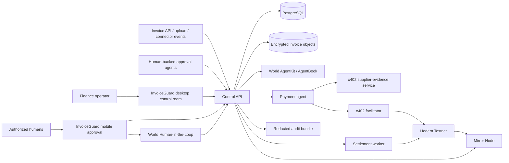
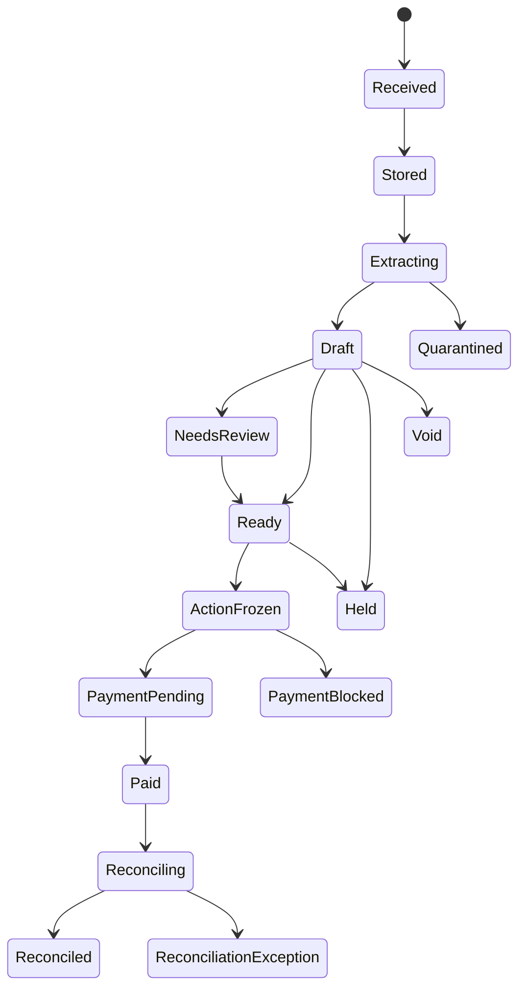
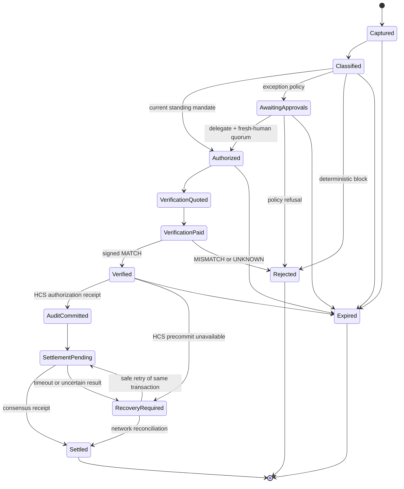

# System architecture

Status: proposed foundation. Sponsor-specific details are frozen only after
their first-party integration spikes pass.

## Architecture principles

1. Deterministic policy, not an LLM, authorizes value movement.
2. Agent backing, company role, standing mandate, action-time human decision,
   agent execution, evidence, and settlement are separate facts.
3. Every external effect is idempotent, replay-resistant, observable, and
   recoverable after process failure.
4. Keys are split by purpose and held only by the component that needs them.
5. Financial operations use Hedera Testnet only. World Chain is used only for
   AgentBook identity registration and lookup.
6. Live sponsor adapters fail closed. A mock can never silently replace a failed
   live dependency.
7. Sensitive evidence and stable identifiers are minimized in logs, databases,
   receipts, and onchain messages.
8. One action digest follows the request through every approval, service
   response, payment, audit event, and settlement.

## System context



## Deployable boundaries

| Deployable                   | Responsibility                                                                               | Secrets                                          |
| ---------------------------- | -------------------------------------------------------------------------------------------- | ------------------------------------------------ |
| `apps/web`                   | Responsive desktop control room and mobile approval experience                               | No treasury, issuer, provider, RP, or agent keys |
| `apps/control-api`           | Invoice ingestion/jobs, authentication, deterministic policy, action state, API, audit       | Database, object-store, connector, and HMAC keys |
| `services/verifier`          | x402 resource, evidence check, and signed digest-bound response                              | Service-signing key                              |
| `services/payment-agent`     | Autonomously purchases the configured verifier resource                                      | Low-balance x402 buyer key                       |
| `services/x402-facilitator`  | Verifies, co-signs, submits, and settles Hedera x402 transactions                            | Capped facilitator fee-payer key                 |
| `services/settlement-worker` | Plans, guards, signs, submits, and recovers the exact approved transfer; writes HCS evidence | Separate settlement and audit-writer keys        |

The control API remains a modular monolith. The verifier is separate because it
is an independently purchased service. The x402 buyer, facilitator, and
settlement worker are separate because they hold different keys and the current
x402 and Agent Kit packages require incompatible Hedera SDK graphs. They
exchange only validated JSON, decimal strings, identifiers, and base64
transaction bytes—never SDK class instances.

0G remains documented as a rejected extension in ADR 0005. It has no runtime
package, credential, or deployment.

## Package boundaries

```text
apps/
  web/
  control-api/
services/
  verifier/
  payment-agent/
  x402-facilitator/
  settlement-worker/
packages/
  domain/              pure entities, values, policy and state transitions
  protocol/            schemas, canonical serialization and signed envelopes
  persistence/         database schema, repositories and transactional outbox
  runtime-config/      fail-closed process identity and environment validation
  world-adapter/       AgentKit and AgentBook integration
  hedera-x402-adapter/ x402 buyer/facilitator protocol and receipts
  hedera-settlement-adapter/ Agent Kit, signing guard, HCS and Mirror
```

Dependencies point inward. Sponsor SDKs may be imported only by their dedicated
adapter packages. Deployables consume validated adapter interfaces; the domain
package has no network, database, framework, or sponsor dependencies.

## Interface boundary

`apps/web` is the only human-facing application. Its desktop routes expose the
invoice queue, source and supplier comparison, deterministic policy trace,
authority state, execution timeline, refusal attempts, reconciliation, and audit
evidence. Its mobile route exposes only the exact exception fields required for
one short-lived approval session.

Both layouts fetch sanitized projections from the control API with `no-store`
semantics. A live dependency failure is rendered as unavailable and never causes
a fixture fallback. Installability may use a web manifest, but service workers
do not cache sensitive projections or queue mutations.

## Invoice ingestion and provenance

The control API accepts source observations through organization-scoped,
idempotent boundaries. Upload is one API client; email, accounting, procurement,
and e-invoice integrations are connector adapters around the same acceptance
port. V1 creates no separate ingestion microservice.

```text
POST /v1/orgs/{org}/invoice-uploads
POST /v1/orgs/{org}/invoice-submissions
POST /v1/connections/{kind}/{connection}/events
POST /v1/orgs/{org}/connections/{connection}/sync
```

Client submissions require an idempotency key and request-body hash. Webhooks
require a pinned signature and unique external event ID; the connection resolves
the organization server-side. Arbitrary remote URL ingestion is forbidden.
Content type and size are bounded before storage and parsing.

Raw documents are encrypted in object storage. PostgreSQL stores hashes,
metadata, normalized facts, immutable snapshots, lifecycle state, and object
references. Extraction runs as a durable, leased job inside the control-plane
deployment and receives no financial key.

InvoiceGuard keeps three records:

### Source observation

```text
schemaVersion
observationId
organizationId
sourceKind            UPLOAD | EMAIL | API | ACCOUNTING
connectionId
externalEventId
sourceTrustClass
receivedAt
mediaType
byteLength
contentSha256
actorReference
```

### Canonical invoice

```text
schemaVersion
invoiceId
organizationId
supplierId
supplierSnapshotDigest
invoiceNumber
issueDate
dueDate
netAmountAtoms
taxAmountAtoms
totalAmountAtoms
assetId
proposedBeneficiary
purchaseOrderReferences
lineItemsRoot
sourceEvidenceRoot
createdAt
```

Extraction output is candidate data with extractor identity, version,
field-level source spans, confidence, parse warnings, observation references,
and its own immutable hash. It becomes canonical only through deterministic
validation and any required operator correction.

The supplier master is independently versioned. An invoice loads an immutable
supplier snapshot containing approved beneficiaries, default asset, payment
terms, status, source connection, and snapshot digest. Invoice ingestion cannot
change that record.

Duplicate controls distinguish:

- exact source-event replay;
- repeated document bytes;
- suspected business duplicate;
- another observation of the same invoice; and
- a previously paid payment action.

A second source may attach to the existing invoice. It cannot create another
payable silently.

## Invoice routing

A frozen policy evaluation binds the action digest, input root, policy version,
route, reason codes, required roles and quorums, and verification mode. The
route is exactly `STRAIGHT_THROUGH`, `HUMAN_APPROVAL`, or `BLOCK`.

`STRAIGHT_THROUGH` requires exact containment by a current standing mandate plus
an enrolled, human-backed, company-authorized payment agent. A model score never
selects this route. `HUMAN_APPROVAL` uses the exception protocol below. `BLOCK`
cannot be overridden on the existing action.

## Action protocol

The canonical action contains no floating-point amounts and no ambiguous
addresses:

```text
schemaVersion
actionId
organizationId
requestType
supplierId
currentBeneficiary
proposedBeneficiary
amountAtoms
assetId
networkId
purposeHash
evidenceRoot
policyId
policyVersion
expiresAt
nonce
createdAt
```

- Network and account identifiers use CAIP-2 and CAIP-10 where applicable.
- V1 uses request type `SUPPLIER_INVOICE_PAYMENT`; the canonical invoice digest
  is its `purposeHash`.
- Amounts are integer atoms with an explicit asset identifier.
- JSON is canonicalized using RFC 8785 before SHA-256 hashing.
- The hash input includes the domain separator `callguard:payment-action:v1`.
- The full action remains immutable. A changed field creates a new action and
  invalidates prior approvals and verification responses.
- Human-readable rendering is generated from the same validated object that is
  hashed.

## Approval protocol

When policy requires human approval, one counted decision requires an agent-side
and a human-side proof.

### Approval delegate

1. The control API stores the immutable action and issues a short-lived
   CAIP-122/SIWE challenge whose exact URI contains that action digest.
2. An ECDSA/secp256k1 agent identity wallet signs the challenge.
3. InvoiceGuard verifies the signature and adds strict checks for the exact URI,
   `resources`, statement, chain, signature type, method, digest, and expiry.
4. World AgentBook resolves the wallet to an anonymous human identifier. An
   independent World RPC health check distinguishes an outage from an
   unregistered wallet.
5. The control API derives
   `agentTenantPrincipal = HMAC-SHA256(orgKey, normalizedHumanId)`.
6. A separately configured company issuer verifies a role grant bound to the
   agent wallet, tenant principal, and authenticated application subject,
   including scope, audience, amount, time bounds, and revocation.

### Action-time human decision

1. The authenticated subject opens a short-lived, single-use approval session.
   The browser loads the immutable action and posts no mutable payment fields.
2. World Human-in-the-Loop uses one action identifier derived from the action
   digest, role, and decision for every slot on that action. Its signal binds
   the application subject and approval session.
3. The control API verifies the proof, recomputes the stored action digest,
   rechecks the role, and derives an action-scoped HMAC of the World nullifier.
4. One database transaction consumes the agent challenge, approval session, and
   World proof, then inserts a decision unique on all three:

   ```text
   (organizationId, actionDigest, subjectId)
   (organizationId, actionDigest, agentTenantPrincipal)
   (organizationId, actionDigest, actionHumanPrincipal)
   ```

5. Deterministic policy counts only decisions whose company subject, agent
   class, and action-human class are all distinct and whose roles remain
   current.

World identity keys, RP credentials, browser sessions, and Hedera financial
accounts are separate principals. Any mapping between them is explicit and
auditable.

The released AgentKit validator is wrapped rather than trusted as the whole
authorization check: it validates origin-level properties but does not itself
enforce the exact path, resource, HTTP method, or CallGuard action. World
Human-in-the-Loop is also an additional fact, not a replacement for agent
backing or company authority.

## Verification protocol

The verifier returns a signed envelope containing:

```text
schemaVersion
serviceId
actionDigest
evidenceRoot
result              MATCH | MISMATCH | UNKNOWN
reasonCodes
issuedAt
expiresAt
servicePaymentTransactionId
providerEvidence    optional, redacted provider verification fields
```

The worker accepts the response only after validating:

- the service signature and configured service identity;
- exact action and evidence binding;
- payment transaction binding;
- result vocabulary and reason codes;
- issuance and expiry;
- no prior response substitution; and
- `MATCH` under the configured deterministic policy.

`UNKNOWN` fails closed.

The x402 facilitator's `/verify` result is not proof of payment. The verifier
releases its signed response only after `/settle` produces a Hedera consensus
receipt with `SUCCESS`. The x402 payment and the later company settlement are
separate transactions; CallGuard joins them with the action digest, service
attestation, HCS authorization precommit, and durable one-use state.

The service result means only that the configured supplier-evidence policy
matched its declared inputs. It does not prove beneficiary ownership, invoice
truth, or compliance. Provider `close match`, no-match, outage, and unsupported
states map to `MISMATCH` or `UNKNOWN`, never `MATCH`.

## Payment rail

The payment action always names one explicit network, asset, integer atom count,
and beneficiary. V1 execution is Hedera Testnet only. The final settlement may
admit HBAR or one allowlisted HTS fungible test token after its integration
spike passes; the signing guard validates the exact transfer type and token ID.

An invoice denominated in EUR is not mapped to an arbitrary HBAR amount. Until a
synthetic EUR-denominated Testnet token is admitted, the UI displays the source
invoice separately from the demonstrated Hedera effect. Test assets have no
monetary value and are never presented as a completed bank or SEPA payment.

A future production `PaymentRail` may target regulated banking, open-banking, or
stablecoin infrastructure only through a new protocol version and explicit
security review.

## Invoice lifecycle



A correction after `ActionFrozen` creates a new invoice revision and payment
action. Accounting write-back failure becomes `ReconciliationException`; it
never changes a successful payment to failed or creates another transfer.

## Payment-action state machine



No transition mutates the canonical action. Terminal actions cannot return to an
executable state.

## Reliable external effects

Database state and network effects cannot be one atomic transaction. CallGuard
uses a transactional outbox and recoverable saga:

1. lock the action row with optimistic version checking;
2. write the intended effect and deterministic idempotency key in the same
   database transaction as the state transition;
3. have the worker claim the outbox item;
4. freeze and persist the exact signed network transaction bytes before
   submission, including its transaction ID and bytes hash;
5. submit once and reconcile an uncertain result through the network/Mirror
   before any retry;
6. resubmit only the same signed transaction when supported; and
7. mark the action consumed only from a valid consensus receipt.

Every request carries `actionId`, `actionDigest`, `attemptId`, `traceId`, and
the source commit SHA.

HCS has explicit asymmetric failure semantics:

- the hashed `authorization.v1` event is a fail-closed precondition to
  settlement;
- the hashed `execution.v1` event is an at-least-once postcommit effect;
- failure after a successful transfer marks the action `audit-degraded` and
  retries the same deterministic event ID; and
- neither public HCS event contains beneficiary details or private evidence.

## Key architecture

| Key                         | Purpose                                               | Rule                                                   |
| --------------------------- | ----------------------------------------------------- | ------------------------------------------------------ |
| World agent identity wallet | AgentKit signing and delegate eligibility             | ECDSA/secp256k1; no treasury balance                   |
| World RP signing key        | Signs action-time Human-in-the-Loop proof requests    | Server only; never sent to `apps/web`                  |
| Company role issuer         | Issues short-lived role credentials                   | Offline or isolated service; never inferred from World |
| Identifier HMAC key         | Derives tenant principals and action display tags     | API only; rotated and never logged                     |
| Verifier signing key        | Signs supplier-evidence envelopes                     | Verifier only; published public key and key ID         |
| Hedera x402 buyer           | Signs the verification-service debit                  | Low balance and per-operation cap                      |
| Hedera x402 facilitator     | Adds the fee-payer signature and submits x402 payment | Separate capped fee-payer account                      |
| Hedera settlement account   | Executes approved Testnet payment                     | Separate key, allowlist, amount cap, gateway only      |
| Hedera audit writer         | Writes HCS authorization and execution event hashes   | Separate low-balance key and topic submit key          |

Production key custody is outside the hackathon claim. Testnet keys are still
treated as secrets and are never committed or exposed to the browser.

## Data classification

| Class     | Examples                                            | Storage/logging rule                                     |
| --------- | --------------------------------------------------- | -------------------------------------------------------- |
| Public    | schema, service public key, testnet transaction ID  | May appear in audit bundle                               |
| Internal  | policy, supplier ID, action digest                  | Structured storage; redact from public logs as needed    |
| Sensitive | invoice, beneficiary details, raw World identifiers | Encrypt at rest; never place onchain; minimize retention |
| Secret    | private keys, API credentials, HMAC key             | Secret manager/environment only; never log               |

The demo uses synthetic supplier data and marks it as synthetic.

## Deployment topology

- Local: Docker Compose with PostgreSQL, an object store, and six Node
  processes.
- Preview: per-PR web/API/verifier deployments using fake adapters only, with an
  unmistakable `FAKE ADAPTERS` banner.
- Live integration: protected environment with sponsor secrets and Testnet
  accounts.
- Demo: `DEMO_MODE=live`; startup fails if any required adapter is fake or a
  financial network is not Hedera Testnet. World Chain `eip155:480` is
  allowlisted only for AgentBook identity operations.

## Observability and evidence

- Structured JSON logs with field-level redaction.
- OpenTelemetry traces across API, worker, verifier, and sponsor calls.
- Metrics for action transitions, refusals, payment latency, settlement
  recovery, and provider failures.
- Evidence manifest containing commit SHA, dependency lock hash, deployment
  identifiers, action digest, redacted sponsor evidence, transaction IDs,
  explorer URLs, negative-test results, and explicit limitations.

## Deferred production concerns

The hackathon demonstrates a bounded Testnet authorization path. Production
would additionally require regulated payment integration, formal key management,
organization onboarding, credential lifecycle governance, privacy review,
service-provider due diligence, independent security audit, incident response,
retention policy, and jurisdiction-specific compliance.
